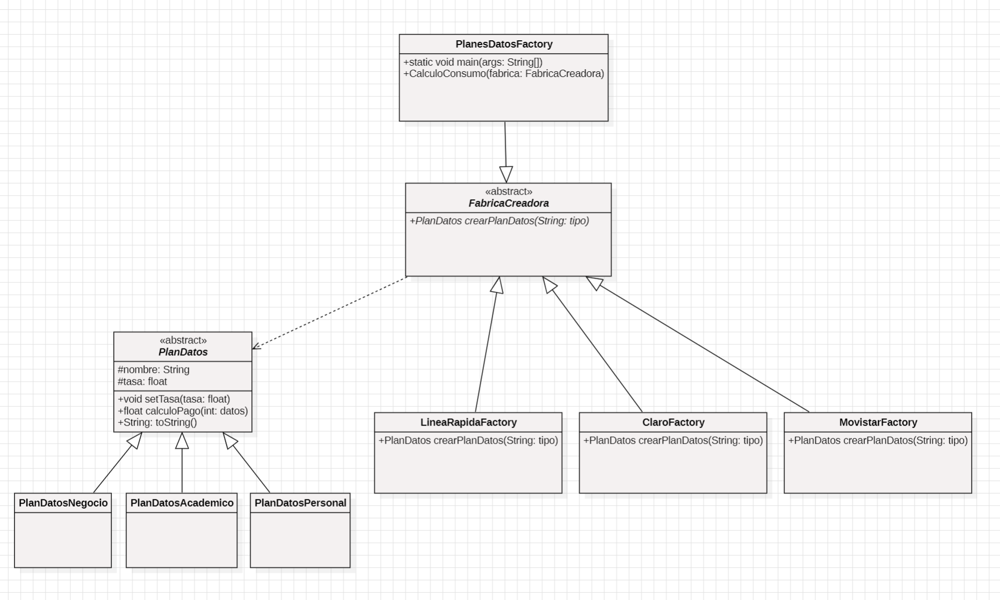

# Practica 013 - Laboratorio
Implementacion del patron FactoryMethod aplicado a planes de datos para 3 proveedores de telefonia: LineaRapida, Claro y Movistar.

## Patron usado : Factory Method
- Producto abstracto: PlanDatos
- Producto concreto: PlanDatosPersonal, PlanDatos y PlanDatosAcademico
- Creador abstracto: FabricaCreadora
- Creadores concretos: LineaRapidaFactory, ClaroFactory y MpvistarFactory

## Diagrama de clases: 

